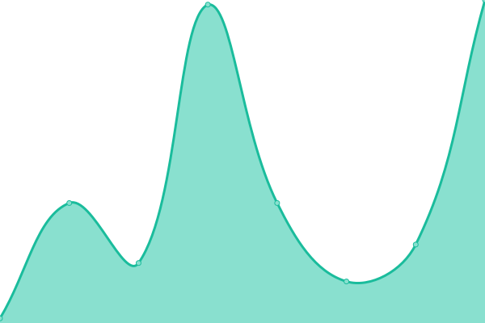
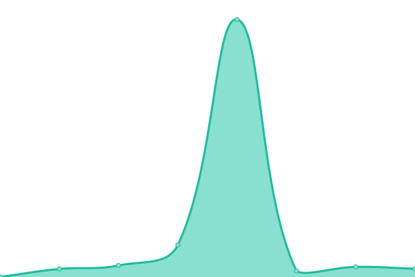

# [📈 Live Status](https://status.stdlib.io): <!--live status--> **🟩 All systems operational**

This repository contains the open-source uptime monitor and status page for [stdlib](https://stdlib.io), powered by [Upptime](https://github.com/upptime/upptime).

With [Upptime](https://upptime.js.org), you can get your own unlimited and free uptime monitor and status page, powered entirely by a GitHub repository. We use [Issues](https://github.com/stdlib-js/www-status/issues) as incident reports, [Actions](https://github.com/stdlib-js/www-status/actions) as uptime monitors, and [Pages](https://status.stdlib.io) for the status page.

<!--start: status pages-->
<!-- This summary is generated by Upptime (https://github.com/upptime/upptime) -->
<!-- Do not edit this manually, your changes will be overwritten -->
<!-- prettier-ignore -->
| URL | Status | History | Response Time | Uptime |
| --- | ------ | ------- | ------------- | ------ |
|  [Website](https://stdlib.io) | 🟩 Up | [website.yml](https://github.com/stdlib-js/www-status/commits/HEAD/history/website.yml) | 

 272ms
     
 | 

<a href="https://status.stdlib.io/history/website">100.00%</a>
    

|  [Documentation](https://stdlib.io/docs/api/status) | 🟩 Up | [documentation.yml](https://github.com/stdlib-js/www-status/commits/HEAD/history/documentation.yml) | 

 50ms
     
 | 

<a href="https://status.stdlib.io/history/documentation">100.00%</a>
    

|  [Development Blog](https://blog.stdlib.io) | 🟩 Up | [development-blog.yml](https://github.com/stdlib-js/www-status/commits/HEAD/history/development-blog.yml) | 

 551ms
     
 | 

<a href="https://status.stdlib.io/history/development-blog">100.00%</a>
    

|  [GitHub Reporting](https://stdlib.io/gh/status) | 🟩 Up | [git-hub-reporting.yml](https://github.com/stdlib-js/www-status/commits/HEAD/history/git-hub-reporting.yml) | 

 79ms
     
 | 

<a href="https://status.stdlib.io/history/git-hub-reporting">100.00%</a>
    

|  [Status Page](https://status.stdlib.io) | 🟩 Up | [status-page.yml](https://github.com/stdlib-js/www-status/commits/HEAD/history/status-page.yml) | 

 227ms
     
 | 

<a href="https://status.stdlib.io/history/status-page">100.00%</a>
    

<!--end: status pages-->

[**Visit our status website →**](https://status.stdlib.io)

## 📄 License

- Powered by: [Upptime](https://github.com/upptime/upptime)
- Code: [MIT](./LICENSE) © [stdlib](https://stdlib.io)
- Data in the `./history` directory: [Open Database License](https://opendatacommons.org/licenses/odbl/1-0/)
